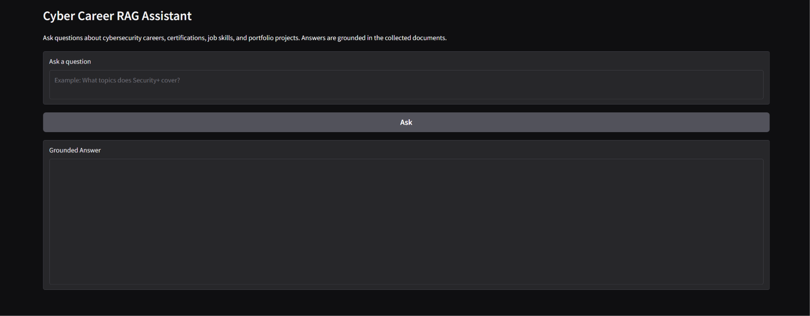
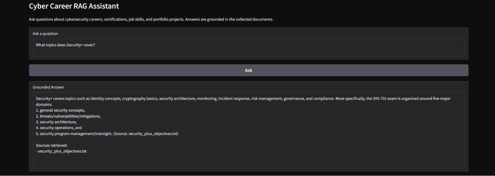
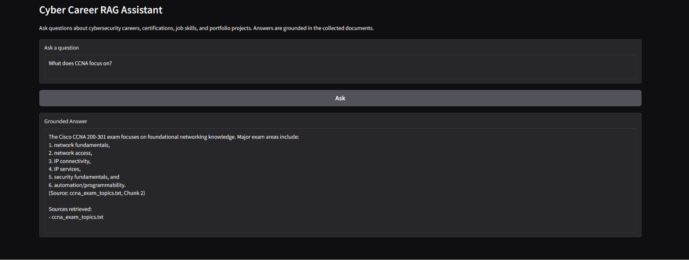
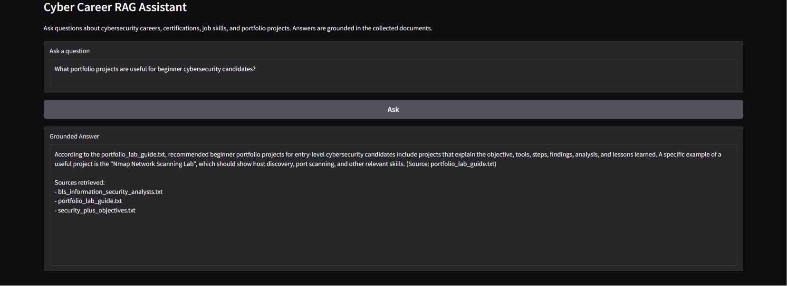
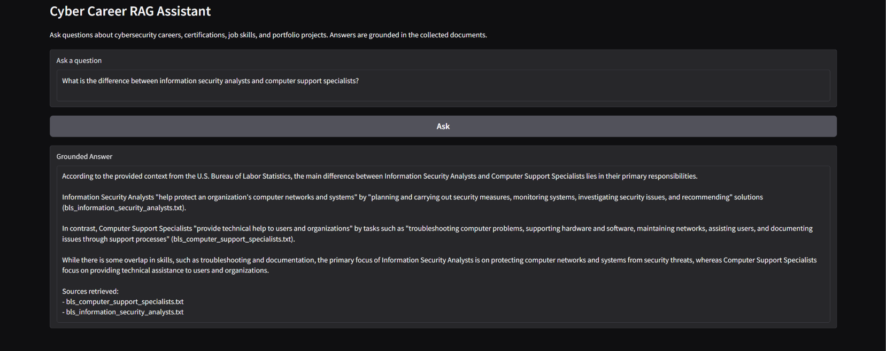
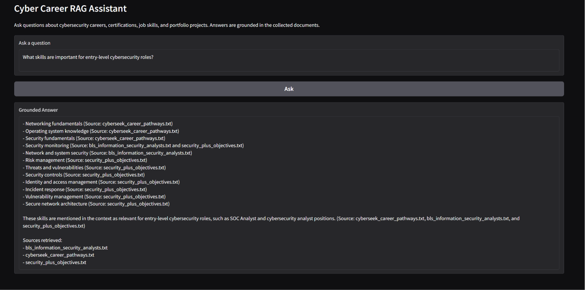
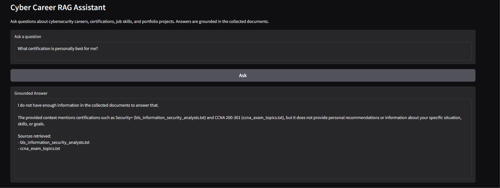
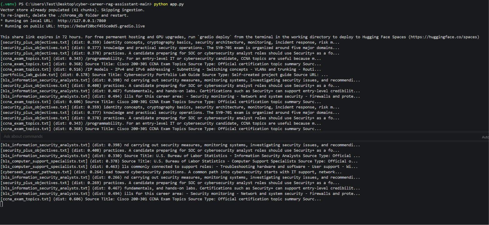

# Cyber Career RAG Assistant

## Overview

Cyber Career RAG Assistant is a Retrieval-Augmented Generation system designed to help entry-level IT and cybersecurity candidates search across career, certification, workforce, and portfolio documents.

The system answers plain-language questions such as:

* What skills are important for entry-level cybersecurity roles?
* What topics does Security+ cover?
* What does CCNA focus on?
* What portfolio projects should a beginner build?
* What is the difference between information security analyst and computer support specialist roles?

Instead of relying only on the language model’s general knowledge, the system retrieves relevant passages from collected documents first, then generates a grounded response using that context.

---

## Problem Statement

Cybersecurity career guidance is spread across many different sources: certification objectives, workforce frameworks, labor statistics, cyber career pathway tools, and practical portfolio advice. For someone trying to break into IT or cybersecurity, it can be difficult to understand what skills, certifications, and projects to prioritize.

This project makes that information searchable by combining document ingestion, chunking, embeddings, semantic search, and grounded LLM response generation.

---

## Domain

The domain for this project is cybersecurity and IT career guidance for entry-level candidates transitioning into roles such as:

* Help Desk Technician
* IT Support Specialist
* SOC Analyst
* Cybersecurity Analyst
* Vulnerability Analyst
* Incident Response Analyst

This knowledge is valuable because official documents often exist separately and are not easy to compare side by side. A RAG assistant can retrieve relevant information from multiple sources and provide a grounded answer with citations.

---

## Document Sources

This project uses 10 source documents stored in the `docs/` folder:

1. `security_plus_objectives.txt`
2. `ccna_exam_topics.txt`
3. `nice_framework_overview.txt`
4. `nice_incident_response_role.txt`
5. `nice_vulnerability_analysis_role.txt`
6. `cyberseek_career_pathways.txt`
7. `bls_information_security_analysts.txt`
8. `bls_computer_support_specialists.txt`
9. `portfolio_lab_guide.txt`
10. `resume_keywords_and_skill_map.txt`

The documents cover certification topics, cybersecurity workforce roles, labor market guidance, beginner portfolio projects, and resume keywords.

A `SOURCE_LIST.md` file is included with the project to document where the collected source documents came from.

---

## Required Features Implemented

* Document ingestion pipeline
* Text cleaning and preprocessing
* Chunking with overlap
* Embeddings using `sentence-transformers`
* Vector storage with ChromaDB
* Semantic retrieval with distance scores
* Grounded response generation using Groq LLM
* Source attribution in responses
* Basic query interface
* Evaluation report with 5 test questions
* Failure case analysis

---

## Tech Stack

| Component             | Tool                           |
| --------------------- | ------------------------------ |
| Language              | Python                         |
| Embeddings            | `sentence-transformers`        |
| Embedding Model       | `all-MiniLM-L6-v2`             |
| Vector Store          | ChromaDB                       |
| LLM                   | Groq `llama-3.3-70b-versatile` |
| Interface             | Gradio                         |
| Environment Variables | `.env`                         |

---

## Architecture

```text
User Documents
     ↓
Document Ingestion
(load .txt files from docs/)
     ↓
Cleaning
(remove extra whitespace, formatting noise, and non-content text)
     ↓
Chunking
(character-based chunks with overlap)
     ↓
Embedding
(sentence-transformers: all-MiniLM-L6-v2)
     ↓
Vector Store
(ChromaDB with source metadata)
     ↓
Retrieval
(top-k semantic search with distance scores)
     ↓
Generation
(Groq LLM with grounded prompt)
     ↓
User Interface
(Gradio app with answer and source attribution)
```

---

## Document Ingestion Pipeline

The ingestion pipeline loads all `.txt` files from the `docs/` folder. Each document is read into memory, cleaned, and stored with metadata such as the source filename.

The pipeline keeps the actual career, certification, skill, and portfolio content while avoiding unnecessary text such as navigation menus, ads, repeated boilerplate, or unrelated formatting artifacts.

Each loaded document is represented with:

```python
{
    "source": "security_plus_objectives.txt",
    "text": "cleaned document text..."
}
```

---

## Chunking Strategy

The project uses a deliberate chunking strategy instead of blindly splitting every document without reasoning.

Current chunking approach:

```text
Chunk size: 500 characters
Overlap: 100 characters
Minimum chunk length: 50 characters
```

This chunk size was chosen because the documents include certification objectives, workforce role descriptions, career guidance, and skill lists. A 500-character chunk is large enough to preserve a complete idea, such as a certification domain or job skill explanation, but small enough to support targeted retrieval.

The 100-character overlap helps preserve context when an important idea spans across two adjacent chunks.

### Why not smaller chunks?

If chunks are too small, they may lose important context. For example, a chunk might mention “incident response” but omit the explanation of what tasks are involved.

### Why not larger chunks?

If chunks are too large, they may contain too many unrelated topics. This can make retrieval less precise because a single chunk may discuss certifications, job titles, skills, and portfolio projects all at once.

---

## Sample Chunks

Below are representative examples of the types of chunks this system creates.

### Sample Chunk 1

Source: `security_plus_objectives.txt`

```text
Security+ covers foundational cybersecurity concepts including threats, vulnerabilities, architecture, operations, and security program management. These topics help entry-level candidates understand how organizations protect systems and respond to risks.
```

### Sample Chunk 2

Source: `ccna_exam_topics.txt`

```text
CCNA focuses on networking fundamentals, IP connectivity, network access, IP services, security fundamentals, automation, and programmability. These skills are useful for IT support, network administration, and cybersecurity roles.
```

### Sample Chunk 3

Source: `nice_incident_response_role.txt`

```text
Incident response work involves identifying, analyzing, and responding to cybersecurity events. Tasks may include reviewing logs, documenting incidents, escalating findings, and supporting recovery actions.
```

### Sample Chunk 4

Source: `portfolio_lab_guide.txt`

```text
Useful beginner cybersecurity portfolio projects include Nmap scanning, Wireshark packet analysis, vulnerability analysis, SOC alert triage, SIEM log analysis, and incident response writeups.
```

### Sample Chunk 5

Source: `resume_keywords_and_skill_map.txt`

```text
Common entry-level cybersecurity resume keywords include ticketing systems, troubleshooting, Active Directory, networking, TCP/IP, DNS, DHCP, VPN, SIEM, log analysis, vulnerability scanning, and incident response.
```

---

## Embedding Model

This project uses:

```text
sentence-transformers/all-MiniLM-L6-v2
```

This model was selected because it runs locally, is lightweight, and does not require a paid embedding API. It provides a practical balance between performance and accessibility for a student project.

For a production system, I would compare embedding models based on:

* Retrieval accuracy
* Cost
* Latency
* Context length
* Multilingual support
* Performance on cybersecurity and career-specific language
* Local model vs. API-based model tradeoffs

---

## Vector Store and Retrieval

The project uses ChromaDB as a local vector database.

Each chunk is stored with:

* Chunk text
* Source filename
* Chunk ID
* Embedding vector

When a user asks a question, the system embeds the query and compares it against the stored document embeddings. It retrieves the top matching chunks using semantic similarity search.

The retrieval function returns:

```python
{
    "text": "retrieved chunk text",
    "source": "source_document.txt",
    "distance": 0.32
}
```

Lower distance scores indicate stronger semantic similarity.

---

## Retrieval Test Results

### Retrieval Test 1

Question:

```text
What topics does Security+ cover?
```

Expected relevant source:

```text
security_plus_objectives.txt
```

Top retrieved chunks mentioned identity concepts, cryptography basics, security architecture, monitoring, incident response, risk management, and the five major Security+ SY0-701 domains.

Relevance judgment: Accurate. The retrieved chunks came from `security_plus_objectives.txt` and directly answered the question.

---

### Retrieval Test 2

Question:

```text
What does CCNA focus on?
```

Expected relevant source:

```text
ccna_exam_topics.txt
```

Top retrieved chunks mentioned networking fundamentals, network access, IP connectivity, IP services, security fundamentals, and automation/programming.

Relevance judgment: Accurate. The retrieved chunks came from `ccna_exam_topics.txt` and matched the expected CCNA exam topic areas.

---

### Retrieval Test 3

Question:

```text
What portfolio projects are useful for beginner cybersecurity candidates?
```

Expected relevant source:

```text
portfolio_lab_guide.txt
```

Top retrieved chunks mentioned beginner portfolio projects, including Nmap network scanning and project documentation.

Relevance judgment: Partially accurate. The answer correctly used `portfolio_lab_guide.txt`, but retrieval also returned some related cybersecurity career sources. This shows that semantic retrieval can pull broader career-related context when the query overlaps with multiple documents.

---

## Grounded Generation

The system uses a grounding prompt to prevent the LLM from answering from general knowledge.

The prompt instructs the model to:

* Answer only using retrieved document context
* Avoid outside knowledge or assumptions
* Cite the source document used
* Refuse to answer if the collected documents do not contain enough information

Example grounding instruction:

```text
You are Cyber Career RAG Assistant. Answer the user's question using only the retrieved document context. Do not use outside knowledge, assumptions, or general career advice. If the answer is not clearly supported by the provided context, say: "I do not have enough information in the collected documents to answer that." Cite the source document used for your answer.
```

This helps reduce hallucinations and makes the response easier to verify.

---

## Query Interface

The project includes a basic query interface built with Gradio.

The interface allows a user to:

1. Enter a career-related cybersecurity question.
2. Submit the query.
3. View a grounded answer.
4. See which source documents were used.

Example interaction:

Question:

```text
What skills are important for entry-level cybersecurity roles?
```

Response:

```text
The system returned a grounded answer listing skills such as networking fundamentals, operating system knowledge, security fundamentals, security monitoring, network and system security, risk management, threats and vulnerabilities, security controls, identity and access management, incident response, vulnerability management, and secure network architecture.
```

Sources retrieved:

```text
bls_information_security_analysts.txt
cyberseek_career_pathways.txt
security_plus_objectives.txt
```

---

## Screenshots

### App Home



### Security+ Answer



### CCNA Answer



### Portfolio Projects Answer



### Role Comparison Answer



### Entry-Level Skills Answer



### Out-of-Scope Refusal



### Retrieval Debug Output



---

## Example Responses

### Example 1

Question:

```text
What topics does Security+ cover?
```

Answer:

```text
Security+ covers topics such as identity concepts, cryptography basics, security architecture, monitoring, incident response, risk management, governance, and compliance. More specifically, the SY0-701 exam is organized around five major domains: general security concepts, threats/vulnerabilities/mitigations, security architecture, security operations, and security program management/oversight.
```

Sources:

```text
security_plus_objectives.txt
```

---

### Example 2

Question:

```text
What does CCNA focus on?
```

Answer:

```text
The Cisco CCNA 200-301 exam focuses on foundational networking knowledge. Major exam areas include network fundamentals, network access, IP connectivity, IP services, security fundamentals, and automation/programming.
```

Sources:

```text
ccna_exam_topics.txt
```

---

### Out-of-Scope Example

Question:

```text
What certification is personally best for me?
```

Answer:

```text
I do not have enough information in the collected documents to answer that. The provided context mentions certifications such as Security+ and CCNA 200-301, but it does not provide personal recommendations or information about a specific situation, skills, or goals.
```

Sources retrieved:

```text
bls_information_security_analysts.txt
ccna_exam_topics.txt
```

---

## Evaluation Report

### Evaluation Question 1

Question:

```text
What topics does Security+ cover?
```

Expected answer:

```text
Security+ covers security concepts, threats, vulnerabilities, architecture, operations, and security program management.
```

System response:

```text
Security+ covers identity concepts, cryptography basics, security architecture, monitoring, incident response, risk management, governance, compliance, security operations, and the five major SY0-701 domains.
```

Retrieved chunks:

```text
security_plus_objectives.txt
```

Accuracy:

```text
Accurate
```

Explanation:

The system retrieved the correct Security+ source document and generated an answer supported by the retrieved context.

---

### Evaluation Question 2

Question:

```text
What does CCNA focus on?
```

Expected answer:

```text
CCNA focuses on networking fundamentals, IP connectivity, network access, IP services, security fundamentals, and automation.
```

System response:

```text
The Cisco CCNA 200-301 exam focuses on foundational networking knowledge, including network fundamentals, network access, IP connectivity, IP services, security fundamentals, and automation/programming.
```

Retrieved chunks:

```text
ccna_exam_topics.txt
```

Accuracy:

```text
Accurate
```

Explanation:

The retrieved chunk directly matched the expected CCNA topic areas.

---

### Evaluation Question 3

Question:

```text
What portfolio projects are useful for beginner cybersecurity candidates?
```

Expected answer:

```text
Useful beginner projects include Nmap scanning, Wireshark packet analysis, vulnerability analysis, SOC alert triage, SIEM/log analysis, and incident response writeups.
```

System response:

```text
The system recommended beginner portfolio projects from portfolio_lab_guide.txt, including project writeups that explain the objective, tools, steps, findings, analysis, and lessons learned. It specifically mentioned an Nmap Network Scanning Lab showing host discovery, port scanning, and relevant skills.
```

Retrieved chunks:

```text
portfolio_lab_guide.txt
bls_information_security_analysts.txt
security_plus_objectives.txt
```

Accuracy:

```text
Partially accurate
```

Explanation:

The system retrieved the correct portfolio source and gave a grounded answer, but it returned a narrower set of project examples than the full expected answer. This is a useful retrieval limitation because the query retrieved some broader cybersecurity career sources in addition to the portfolio guide.

---

### Evaluation Question 4

Question:

```text
What is the difference between information security analysts and computer support specialists?
```

Expected answer:

```text
Information security analysts focus on protecting systems and responding to cyber threats, while computer support specialists help users and organizations solve technical problems.
```

System response:

```text
Information Security Analysts help protect an organization's computer networks and systems by planning and carrying out security measures, monitoring systems, investigating security issues, and recommending solutions. Computer Support Specialists provide technical help to users and organizations by troubleshooting computer problems, supporting hardware and software, maintaining networks, assisting users, and documenting issues through support processes.
```

Retrieved chunks:

```text
bls_information_security_analysts.txt
bls_computer_support_specialists.txt
```

Accuracy:

```text
Accurate
```

Explanation:

The answer correctly used both BLS-related documents and clearly compared the two roles.

---

### Evaluation Question 5

Question:

```text
What skills are important for entry-level cybersecurity roles?
```

Expected answer:

```text
Important skills include networking fundamentals, troubleshooting, documentation, security concepts, vulnerability analysis, incident response basics, and log or SIEM analysis.
```

System response:

```text
The system listed skills including networking fundamentals, operating system knowledge, security fundamentals, security monitoring, network and system security, risk management, threats and vulnerabilities, security controls, identity and access management, incident response, vulnerability management, and secure network architecture.
```

Retrieved chunks:

```text
bls_information_security_analysts.txt
cyberseek_career_pathways.txt
security_plus_objectives.txt
```

Accuracy:

```text
Accurate
```

Explanation:

The response matches the expected skill areas and cites relevant source documents.

---

## Failure Case

Failure question:

```text
What certification is personally best for me?
```

Expected behavior:

```text
The system should avoid giving a personalized recommendation unless the collected documents provide enough personal context.
```

System response:

```text
I do not have enough information in the collected documents to answer that. The provided context mentions certifications such as Security+ and CCNA 200-301, but it does not provide personal recommendations or information about a specific situation, skills, or goals.
```

Accuracy:

```text
Accurate refusal
```

Why this happened:

The system’s documents contain general career guidance, certification topics, and role descriptions, but they do not contain enough personal information about the user’s background, goals, budget, timeline, or experience level to make a fully personalized recommendation.

How to improve:

A future version could add a user profile intake form or allow the user to provide personal constraints such as current experience, certifications, target roles, timeline, and preferred learning style.

---

## Spec Reflection

One way the spec helped guide implementation was by forcing the project to define the domain, documents, chunking strategy, retrieval approach, and evaluation plan before writing code. This made the pipeline easier to build because each implementation step had a clear purpose.

One way the implementation diverged from the original plan was that the chunking approach remained relatively simple and character-based. A more advanced version could use paragraph-aware or heading-aware chunking to better preserve document structure, especially for certification objectives and role descriptions.

---

## AI Usage

AI tools were used to support implementation and documentation, but the system design decisions were reviewed and adjusted manually.

### AI Usage Example 1

I used AI assistance to help adapt a previous RAG lab structure into a cybersecurity career-focused RAG assistant. The AI helped identify which files needed to change, such as `ingest.py`, `retriever.py`, `generator.py`, and `app.py`.

I reviewed the output and adjusted the wording from board-game rule language to cybersecurity career document language.

### AI Usage Example 2

I used AI assistance to draft the grounded generation prompt. The AI suggested instructions to prevent the model from using outside knowledge. I kept the core grounding requirement but made sure the final prompt required source attribution and an explicit refusal when the documents did not support an answer.

---

## How to Run the Project

### 1. Clone the repository

```bash
git clone https://github.com/Jose-CyberSec/cyber-career-rag-assistant.git
cd cyber-career-rag-assistant
```

### 2. Create a virtual environment

Windows PowerShell:

```powershell
python -m venv .venv
.venv\Scripts\activate
```

Mac/Linux:

```bash
python -m venv .venv
source .venv/bin/activate
```

### 3. Install dependencies

```bash
pip install -r requirements.txt
```

### 4. Create `.env`

Copy `.env.example` to `.env`.

Windows PowerShell:

```powershell
Copy-Item .env.example .env
```

Mac/Linux:

```bash
cp .env.example .env
```

Then add your Groq API key:

```text
GROQ_API_KEY=your_key_here
```

Do not commit `.env`.

### 5. Run the app

```bash
python app.py
```

Open the local URL shown in the terminal, usually:

```text
http://127.0.0.1:7860
```

---

## Security Note

This project uses a `.env` file for the Groq API key. The `.env` file should never be committed to GitHub.

The repo should include `.env.example` only.

---

## Future Improvements

Potential improvements include:

* Add metadata filtering by source type, such as certification, job outlook, workforce framework, or portfolio guide
* Compare semantic search against hybrid search with BM25
* Add a user profile form for more personalized career recommendations
* Add a larger evaluation set
* Improve chunking with heading-aware or paragraph-aware splitting
* Add source links directly in the UI
* Add confidence indicators based on retrieval distance scores

---

## Demo Video

Demo video link will be added after recording.

The demo will show:

* At least three different questions
* Source citations visible in the response
* One successful retrieval example
* One out-of-scope refusal
* A walkthrough of the evaluation report
